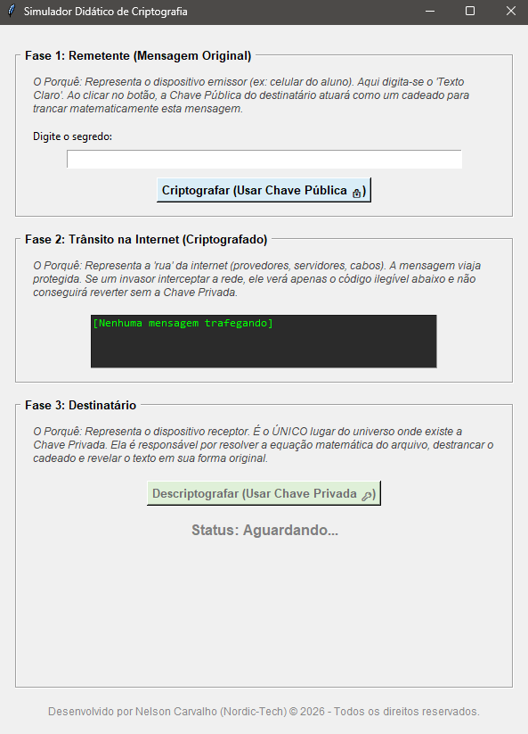
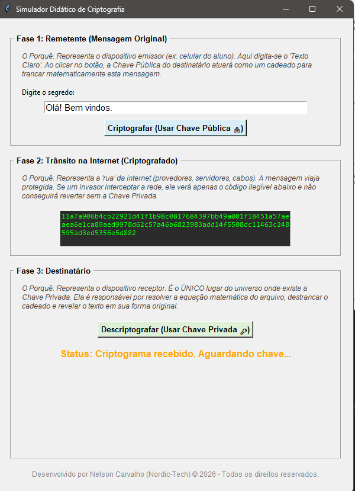
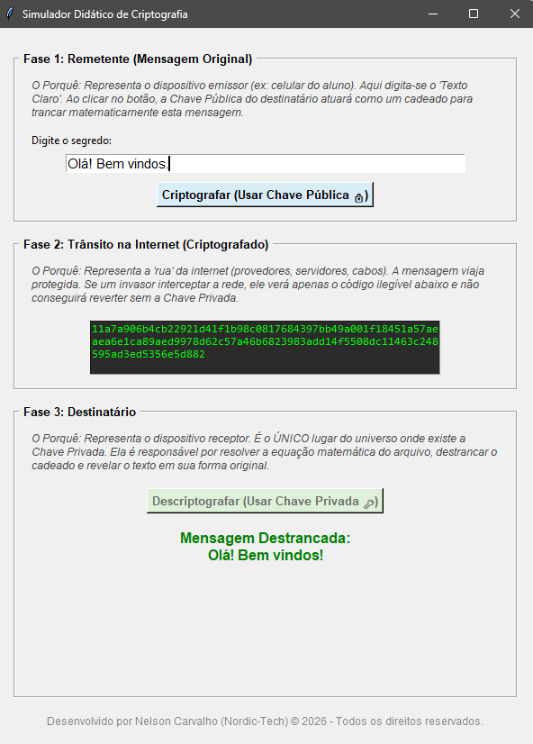

# 🔐 Simulador Didático de Criptografia (Ponta a Ponta)

> Uma ferramenta educacional interativa desenvolvida em Python para demonstrar visualmente o funcionamento da Criptografia Assimétrica (Chaves Pública e Privada).

Este projeto foi concebido como material de apoio pedagógico para aulas de tecnologia e segurança da informação, permitindo que os alunos visualizem o ciclo de vida de uma mensagem criptografada de ponta a ponta (E2EE) sem precisarem lidar com as complexidades matemáticas dos bastidores.

---

## 🎯 Objetivo do Projeto

O simulador divide a tela em três fases distintas para ilustrar claramente onde e como os dados se encontram em cada etapa da comunicação na internet:

1. **📱 Fase 1: Remetente (O Dispositivo de Origem):** Onde o "Texto Claro" é digitado e trancado usando a **Chave Pública** do destinatário (atuando como um cadeado).
2. **🌐 Fase 2: Trânsito na Internet (A Zona de Risco):** Representa a rede pública. A mensagem é exibida em formato hexadecimal inlegível, provando visualmente que uma interceptação (sniffing) não compromete o segredo.
3. **📱 Fase 3: Destinatário (O Dispositivo de Destino):** O único local onde reside a **Chave Privada**. A ferramenta destranca a matemática da mensagem e exibe o texto original.

---

## 📸 Demonstração Visual





A interface foi projetada com foco na clareza. Caixas de texto explicativas acompanham cada fase do aplicativo, transformando a própria ferramenta em um material de leitura e compreensão passo a passo para o aluno.

---

## 🚀 Como Executar o Código-Fonte

Se você é um desenvolvedor ou professor e deseja rodar o projeto diretamente do código Python, siga os passos abaixo:

### Pré-requisitos
Certifique-se de ter o [Python](https://www.python.org/) instalado em sua máquina.

### Instalação
1. Clone este repositório:
```bash
git clone https://github.com/NordicManX/App_Criptografia_E2EE_.git
```

2. Instale a biblioteca de criptografia matemática (rsa):
```bash
pip install rsa
```
3. instale a biblioteca de interface visual grafica:
```bash
pip install tkinter
```

4. Execute o simulador:
```bash
python app_criptografia.py
```

## - 📦 Distribuindo para Alunos (Versão Executável)
### Para facilitar o uso em sala de aula ou em computadores de escolas que não possuem o Python instalado, o projeto pode ser empacotado em um arquivo único executável (.exe para Windows).
### Na lateral direita em Releases a opção v1.0.0 estará disponivel.

Caso deseje compilar a sua própria versão executável:
```bash
pip install pyinstaller
pyinstaller --onefile --noconsole app_criptografia.py
```

O arquivo final estará disponível na pasta dist/ gerada automaticamente.

## 🛠️ Tecnologias Utilizadas
Python 3: Linguagem base do projeto.

Tkinter: Biblioteca padrão do Python utilizada para a construção da Interface Gráfica de Usuário (GUI).

RSA: Módulo Python puro responsável pela geração do par de chaves matemáticas de 512 bits e pelas funções de encrypt/decrypt.

Binascii: Utilizado para a conversão didática dos bytes criptografados em formato de string hexadecimal.
